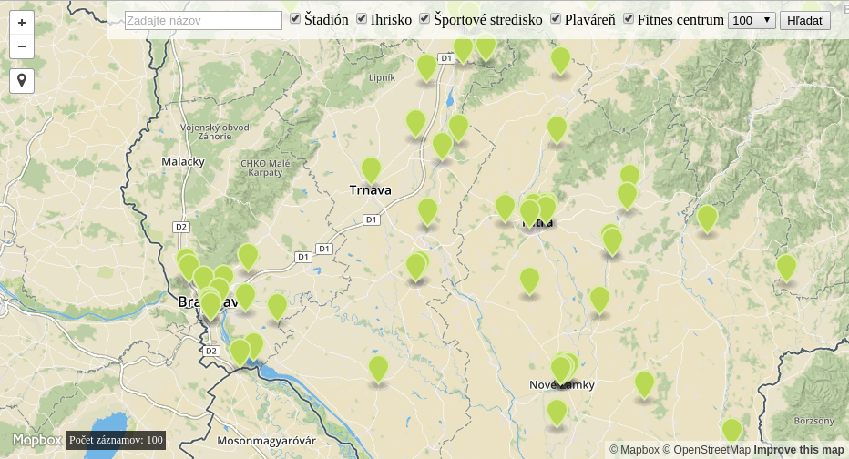

# Overview

Táto aplikácia zobrazuje športoviská na Slovensku. K hlavným vlastnostiam patrí:
- zobrazenie všetkých športovísk na Slovensku
- vyhľadanie podľa typu športoviska
- vyhľadanie podľa mojej polohy

Náhľad aplikácie:

Aplikácia má dve samostatné časti. Klientskú časť tvorí [frontend webová aplikácia](#frontend) využívajúca MAPbox API a mopbox.js a [backend aplikácia](#backend) je v PHP frameworku [Laravel](https://laravel.com/), pričom dáta čerpá z PostGIS databázy. Frontend komunikuje s backendom cez Laravel [REST API](#api).

# Frontend

Frontend webová aplikáciu tvorí statická html stránka ('MVC_index.blade.php'), ktorá zobrazuje mapbox.js. Ten zobrazuje športoviská na Slovensku na základnej mape, ktorú poskytuje Mapbox API.

Všetky potrebné volania sú asynchrónne a realizované pomocou ajaxu cez javascript a všetky sa nachádzajú v 'script.js', na ktorý sa odkazuje 'MVC_index.blade.php'.
 Frontend webová aplikácia je jednoduchá na používanie a obsahuje základnú funkcionalitu:
 - zistenie polohy používateľa pomocou [web location API](https://github.com/domoritz/leaflet-locatecontrol)
 - zobrazenie formulára so zoznamom športovísk a filtra počtu výsledkov, ktorý získava dáta z backend API
 - zobrazenie geo funkcionalít, ktoré tvoria ďalšiu vrstvu nad mapov. GeoJSON dáta sú získavané priamo z databázy prostredníctvom backend API.

# Backend

Backend aplikácia je napísaná pomocou PHP frameworku Laravel a získava geo dáta priamo z databázy PostGIS, tie následne aj naformátuje priamo do požadovaného GeoJSON formátu.

## Data

Informácie o športoviskách mám priamo z Open Street Máp. Tie som stiahol zo stránky [geofabrik.com](http://download.geofabrik.de/europe/slovakia.html) a importoval do postgreql databázy pomocou 'osm2pgsql' nástroja do štandardnej OSM schémy vo formáte WGS84. Všetky potrebné selecty sa nachádzajú vo 'web.php' a Laravel ich volá na adrese '/api'. GeoJSON je generovaný pomocou štandardnej funkcie 'st_asgeojson'.

## Api

**Nájdi 100 športovísk typu Štadión a Ihrisko**

`http://localhost:8000/api?title=&choices%5B%5D=stadium&choices%5B%5D=pitch&limit=100`

**Nájdi moju polohu**

`http://b.tiles.mapbox.com/v4/mapbox.streets/14/8970/5685.png?access_token={access token}}`

### Response

API vracia json objekt z databázy, ktorý si následne pomocou parsera upraví. Jednotlivé parametre json záznamov sú:

    {
      "type": "Feature",
      "geometry": {
        "type": "Point",
        "coordinates": [17.481669, 48.337142]
      },
      "properties": {
        "title": "TheNameOfPoint",
        "marker-color": "#bada55";
      }
    }
